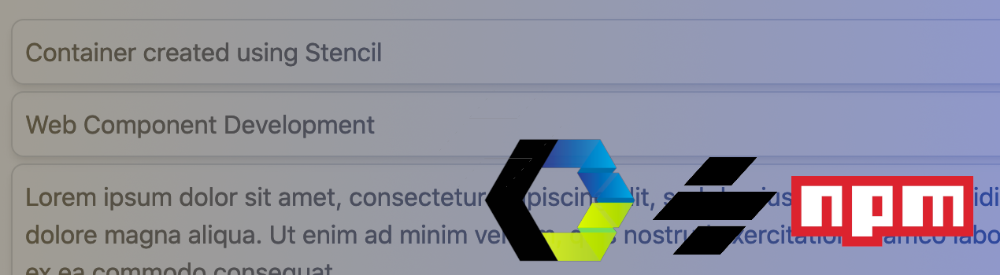
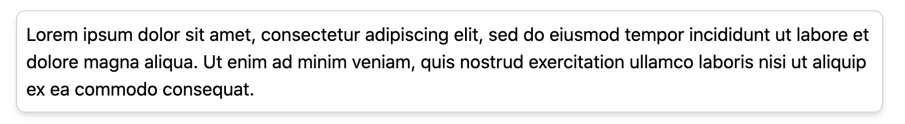
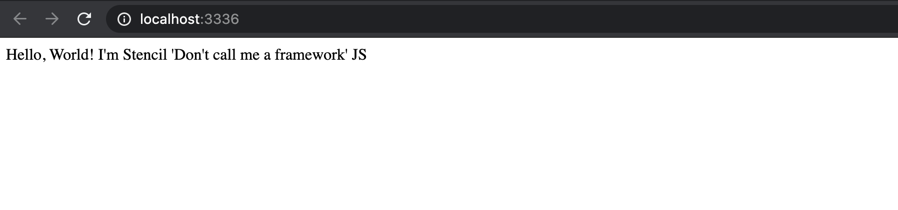

Not long ago, the concept of web components seemed to feel so far in the future. In 2021, more and more companies and design systems are starting to build web component solutions. 

In the first post of The Blinking Marquee, we’ll dive into the process of building and publishing a very simple web component to the public [NPM registry](https://www.npmjs.com/). This is the first post of hopefully many that will focus on concepts within front-end application development, an environment that is constantly evolving with new technology being introduced every single day.

Before we go too far...

## What is a Web Component?

Keeping things simple: it is technology that allows developers to build custom application elements using JavaScript APIs, an encapsulated DOM tree, and reusable templates. For all of the details, take a look at [webcomponents.org](https://www.webcomponents.org/introduction#what-are-web-components-).

## Why are Web Components Useful?

Regardless of the scope of work, computing technology has always set out to accomplish a core goal: abstract programming patterns so that those patterns can be reused, and make the life of a developer more efficient. Computing thrives on abstraction of code.

Web components are an abstraction for UI/UX development. They help design and development teams define a common, reusable user interface across an application, or even a suite of applications. And while it is possible to accomplish the implementation of this concept with amazing Javascript frameworks like React, Angular, and Vue, web components are technology-agnostic. You can develop the components once and use them with any Javascript technology, server-side technology, or just a plain old HTML file.

## How Can Web Components Be Created? 

Developers can use the web components API directly with vanilla Javascript. But again, abstractions exist to make our lives easier. [Many libraries and tools now exist](https://www.webcomponents.org/libraries) to help us more easily create web components, like [Polymer](https://www.polymer-project.org/), [LitElement](https://github.com/Polymer/lit-element), and [Stencil](https://stenciljs.com/). 

This tutorial will utilize Stencil. It's a build-time compiler that generates web components utililizing Typescripx and JSX, a similar concept familiar to React developers. 

> [Read more about Stencil](https://stenciljs.com/docs/introduction), its tooling, and its benefits.

## Let’s Get Started

### The Component

We'll build a very simple `container` component as an example.



This will be nothing more than a wrapper for content that applies so basic style. It will be utilized as a building block for some other components on this blog. 

Later posts will deal with more detailed patterns, but the focus now is the basics. Setup, a basic build, and publishing. 

### Install Dependencies

#### Stencil

As explain in Stencil's [Getting Started documentation](https://stenciljs.com/docs/getting-started), all you need to do is run:

``` bash
$ npm init stencil
```

This command will walk you through the setup of a stencil project. You can set up an application, progressive web app, or a component. For this purpouse, we will be building a `component`. By choosing the `component` option, it will scaffold an environment where you can set up multiple components as a library.

You will be promoted to choose a project name, and that's it! `cd` into your project directory, run `npm install`, then `npm start`. A browser tab will launch a demo app running with a sample web component displayed.

#### Tailwind CSS

We are also going to be using [Tailwind CSS](https://tailwindcss.com/), a versatile CSS framework packed with utility classes. Try it out if you haven't already. It's a really interesting perspective on the CSS framework concept.

``` bash
$ npm install tailwindcss --save-dev
```

A couple of Tailwind's peer dependencies will need to be installed:

``` bash
$ npm install postcss autoprefixer @stencil/postcss @types/autoprefixer --save-dev
```

Then create a `tailwind.config.js` file:

``` bash
npx tailwindcss init
```

Complete the tailwind setup by adding a few imports to the `stencil.config.ts` file:

``` ts
import { postcss } from '@stencil/postcss';
import autoprefixer from 'autoprefixer';
import tailwindcss from 'tailwindcss';
```

And then configure the `postcss` plugin configured with `autoprefixer` and `tailwindcss`:

``` ts
plugins: [
  postcss({
    plugins: [autoprefixer(), tailwindcss()]
  })
]
```

Your final `stencil.config.ts` will look like:

``` ts
import { Config } from '@stencil/core';
import { postcss } from '@stencil/postcss';
import autoprefixer from 'autoprefixer';
import tailwindcss from 'tailwindcss';

export const config: Config = {
  namespace: 'planit-components',
  outputTargets: [
    {
      type: 'dist',
      esmLoaderPath: '../loader',
    },
    {
      type: 'dist-custom-elements-bundle',
    },
    {
      type: 'docs-readme',
    },
    {
      type: 'www',
      serviceWorker: null, // disable service workers
    },
  ],
  plugins: [
    postcss({
      plugins: [autoprefixer(), tailwindcss()]
    })
  ]
};
```

Now test out your progress so far. Start the server:

``` bash
npm start
```

And you should see Stencil's default web component render in the browser:



### Development

Now its time to get to the actual development ...

Stencil makes things easy for us again. It comes with a command to scaffold a web component for you, so that you don't need to remember all of the details and make sure everything is manually set up just right. Just run:

``` bash
npm run generate my-container
```

... replacing the `my` with whatever you'd like as your prefix. It is a requirement for your component selector to have a prefix and contain a dash.

In your editor, you'll find your newly generated component under `src/container/my-container`. Witin the `my-container` directory, open `my-container.tsx` with your preferred editor. This is the main file we'll be editing to create the web component, and it will look something like this:

``` ts
import { Component, Host, h } from '@stencil/core';

@Component({
  tag: 'planit-container',
  styleUrl: 'planit-container.css',
  shadow: true,
})
export class PlanitContainer {

  render() {
    return (
      <Host>
        <slot></slot>
      </Host>
    );
  }

}
```

The first line of the component imports some core dependencies from the core Stencil package:

``` ts
import { Component, Host, h } from '@stencil/core';
```

### Publishing to NPM

npm init --scope=@planit
create publish script
- git tag
- move package.json
- npm publish
git push tag

### Try Out Your Component

## Development Resources

### Tutorial Resources

- [PlanIt Repository](https://github.com/planavsky82/planit)
- [PlanIt Container Component](https://github.com/planavsky82/planit/tree/master/src/components/planit-container)

### Additional Resources

- [WebComponents.org](https://www.webcomponents.org/libraries)
- [Web Components Libraries](https://www.webcomponents.org/libraries)
- [Stencil](https://stenciljs.com/docs/introduction)
- [Node Package Manager](https://www.npmjs.com/)
