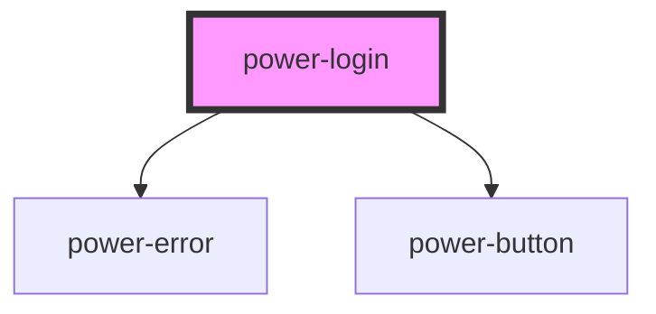

# power-login

<!-- Auto Generated Below -->

## Properties

| Property            | Attribute             | Description | Type     | Default           |
| ------------------- | --------------------- | ----------- | -------- | ----------------- |
| `labelEmailAddress` | `label-email-address` |             | `string` | `"Email Address"` |
| `labelPassword`     | `label-password`      |             | `string` | `"Password"`      |

## Events

| Event         | Description | Type                      |
| ------------- | ----------- | ------------------------- |
| `submitLogin` |             | `CustomEvent<LoginEvent>` |

## Dependencies

### Depends on

- [power-error](../power-error)
- [power-button](../power-button)

### Graph

----------------------------------------------

*Built with [StencilJS](https://stenciljs.com/)*
